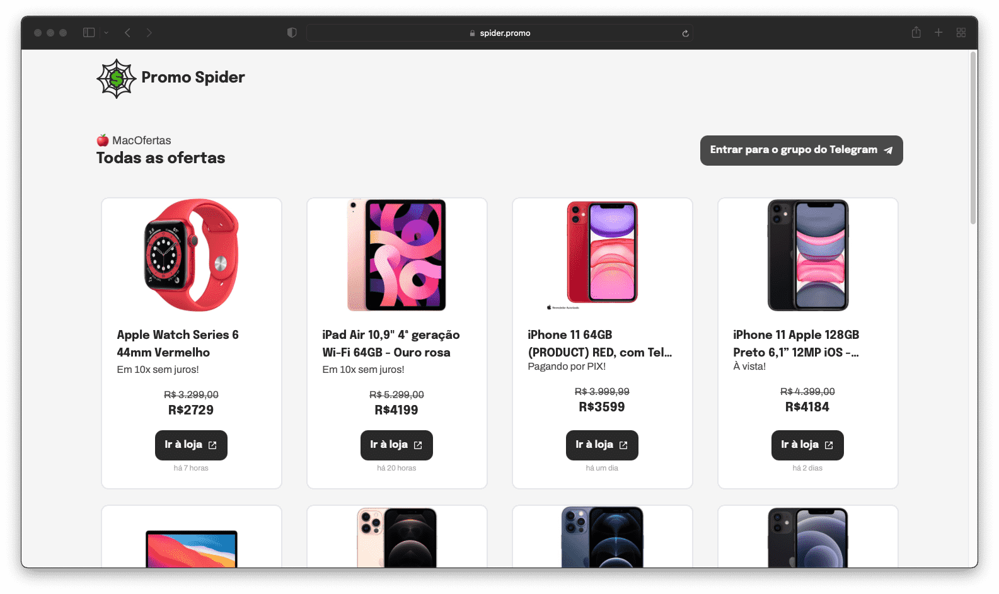
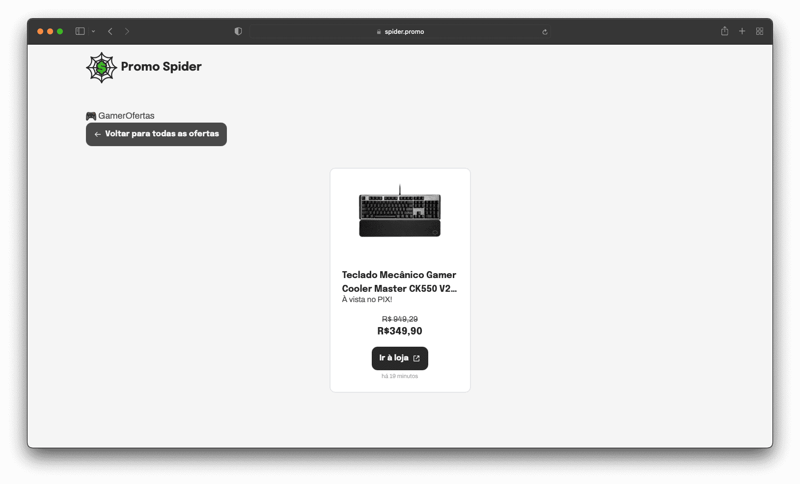

<p align="center">
  
</p>

<h1 align="center">Promo Spider Website</h1>
<p>
</p>

> 🕸🤑 Landing page for the Promo Spider project.

### 🏠 [Homepage](https://promo-spider-web.vercel.app/)


 
## Install

```sh
yarn #npm install
```

## Usage

```sh
yarn dev #npm run dev
```

## Author

👤 **LF Verissimo**

* Website: https://lfverissimo.com
* Github: [@luizfverissimo](https://github.com/luizfverissimo)
* LinkedIn: [@lfverissimo](https://linkedin.com/in/lfverissimo)

## Show your support

Give a ⭐️ if this project helped you!

***
_This README was generated with ❤️ by [readme-md-generator](https://github.com/kefranabg/readme-md-generator)_
